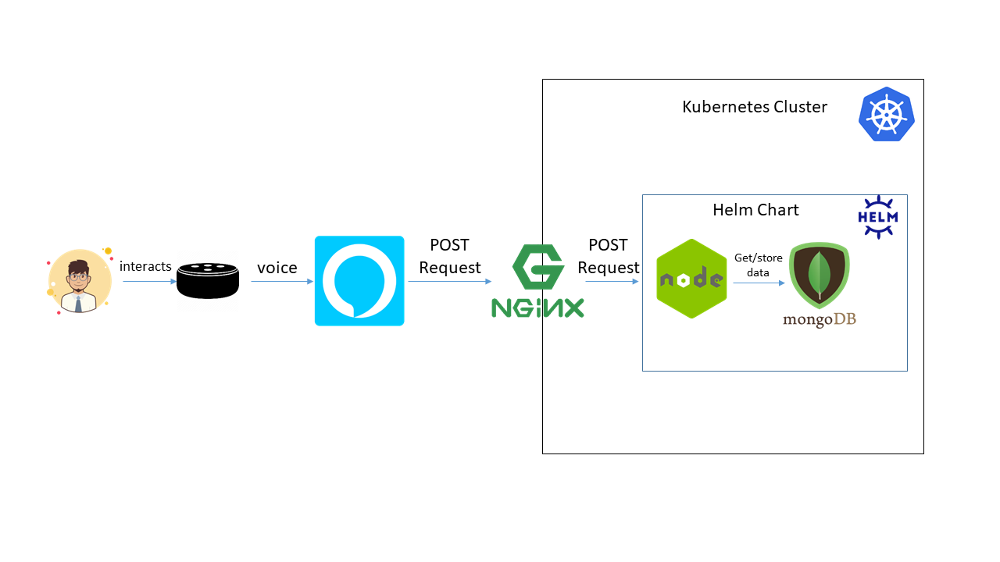

# Alexa Running in Kubernetes

<!-- TOC -->

- [Alexa Running in Kubernetes](#alexa-running-in-kubernetes)
  - [1. Alexa Skill as a web server](#1-alexa-skill-as-a-web-server)
  - [2. MongoDB persistence adapter](#2-mongodb-persistence-adapter)
  - [3. Dockerizing the Alexa Skill](#3-dockerizing-the-alexa-skill)
  - [4. Kubernetes objects of the Alexa Skill](#4-kubernetes-objects-of-the-alexa-skill)
  - [5. Local development](#5-local-development)
  - [6. Helm chart](#6-helm-chart)
  - [7. Terraform.](#7-terraform)
    - [7.1. Deploying the Alexa Skill on AWS Elastic Kubernetes Services](#71-deploying-the-alexa-skill-on-aws-elastic-kubernetes-services)
    - [7.2. Deploying the Alexa Skill on Azure Kubernetes Services](#72-deploying-the-alexa-skill-on-azure-kubernetes-services)
    - [7.3. Deploying the Alexa Skill on Google Kubernetes Engine](#73-deploying-the-alexa-skill-on-google-kubernetes-engine)

<!-- /TOC -->

In this repository you will find all the resources needed to transform or create an Alexa Skill on Kubernetes.
These are the two possible options you can use for running your Alexa Skill on kubernetes:

**1. Using Mongo Atlas Cloud Schema**


**2. Using Provided Mongo Schema**


Those multiple options are supported by this implementation.

These are the main folders of the project:

```bash
    ├───.vscode
    ├───alexa-skill
    ├───app
    ├───docker
    ├───helm
    └───terraform
        ├───eks
        ├───aks
        └───gke
```

* **.vscode:** launch preferences to run locally your Skill for local testing.
* **alexa-skill:** this folder contains all the metadata of the Alexa Skill such as the interaction model, assets, Skill manifest, etc. In this folder you will be able to run all the `ask cli` commands.
* **app:** the backend of the Alexa Skill a NodeJS app using Express.
* **docker:** where you can find the Dockerfile of the Alexa Skill backend as a NodeJS app.
* **helm:** the helm chart of the Alexa Skill ready to be deployed on any Kubernetes Cluster.
* **terraform:** Terraform files per different kind of private clouds.
  * **eks:** All the files needed to deploy an Alexa Skill and a Kubernetes Cluster on AWS Elastic Kubernetes Service.
  * **aks:** All the files needed to deploy an Alexa Skill and a Kubernetes Cluster on Azure Kubernetes Service.
  * **gke:** All the files needed to deploy an Alexa Skill and a Kubernetes Cluster on Google Kubernetes Engine.


Let's explaing all the steps required to create an Alexa Skill and deploy it on a Kubernetes cluster.
In each step you will find all the pre-requisites needed for that step.

## 1. Alexa Skill as a web server

How to create an Alexa Skill as a NodeJS app using Express. Check the full explanation [here](docs/WEBSERVER.md).

## 2. MongoDB persistence adapter

The test job will execute the unit tests. Check the full explanation [here](https://github.com/xavidop/ask-sdk-mongodb-persistence-adapter).

## 3. Dockerizing the Alexa Skill

The test job will execute the unit tests. Check the full explanation [here](docs/DOCKER.md).

## 4. Kubernetes objects of the Alexa Skill

The test job will execute the unit tests. Check the full explanation [here](docs/KUBERNETES.md).

## 5. Local development

The test job will execute the unit tests. Check the full explanation [here](docs/LOCAL_DEVELOPMENT.md).

## 6. Helm chart

The test job will execute the unit tests. Check the full explanation [here](docs/HELM.md).

## 7. Terraform.

### 7.1. Deploying the Alexa Skill on AWS Elastic Kubernetes Services

The test job will execute the unit tests. Check the full explanation [here](docs/TERRAFORM_EKS.md).

### 7.2. Deploying the Alexa Skill on Azure Kubernetes Services

The test job will execute the unit tests. Check the full explanation [here](docs/TERRAFORM_AKS.md).

### 7.3. Deploying the Alexa Skill on Google Kubernetes Engine

The test job will execute the unit tests. Check the full explanation [here](docs/TERRAFORM_GKE.md).
