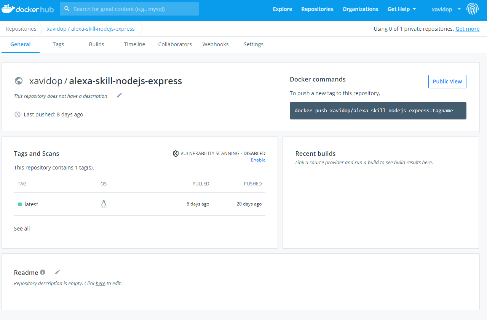

# Alexa and Kubernetes: Dockerizing the Alexa Skill

The second task we have to do to run our Alexa Skill in a kubernetes environment is to dockerize our Alexa Skill backend which now is an NodeJs Express app. 

As a Kubernetes is kind of Container orchestrator, this is a mandatory step in our process to run the Alexa skill in a Kubernetes environment.

## Prerequisites

Here you have the technologies used in this project
1. Node.js v12.x
2. Visual Studio Code
3. Docker 19.x

## Dockerfile

Docker can build images automatically by reading the instructions from a Dockerfile. A Dockerfile is a text document that contains all the commands a user could call on the command line to assemble an image. Using docker build users can create an automated build that executes several command-line instructions in succession.

```dockerfile
FROM node:12.18-alpine
WORKDIR /usr/src
COPY ./app/ .
RUN npm install
EXPOSE 3000
ENTRYPOINT ["npm", "start"]
```

These are the steps that the `Dockerfile` will execute when we build it:
1. We will use the NodeJS 12.18 version running in a Linux Alpine container.
2. We will set the working directory of the container to `/usr/src`.
3. Then we will copy our Alexa Skill as a NodeJS Express Web server.
4. We will execute the `npm install` command to dowonload and install all the required dependencies.
5. Our Express Web Server are running on the 3000 port so we need to `expose` it in our container as well.
6. Finally, we will start the Express Web server running `npm start` command.

The `Dockerfile` is located on the `docker` folder.

## Build the Docker Image

Explained all the steps of our `Dockerfile`, it is time to build that in order to have our container ready to run.

This is an example of a Docker Build command:
```bash
## Build
docker build -t xavidop/alexa-skill-nodejs-express:latest -f docker/Dockerfile .
```

**NOTE:** this command has to be run on the root folder of this project.

## Push the Docker Image

This is an example of a Docker Push command:
```bash
## Push
docker push xavidop/alexa-skill-nodejs-express:latest
```

**NOTE:** this command has to be run on the root folder of this project.

After pushing the image you can take a look to your Docker Registry to inspect all the information. You can find an example [here](https://hub.docker.com/repository/docker/xavidop/alexa-skill-nodejs-express/general). I am using [Docker Hub](https://hub.docker.com):




## Running the Docker Container 

We can run our docker container once we had built it. 
You can run it with the following command:
```bash
#Run
docker run -i -p 3000:3000 -t xavidop/alexa-skill-nodejs-express:latest
```

**NOTE:** this command has to be run on the root folder of this project.

After executing this, you can excute Alexa requests to `localhost:3000` endpoint.

## Resources
* [Official Alexa Skills Kit Node.js SDK](https://www.npmjs.com/package/ask-sdk) - The Official Node.js SDK Documentation
* [Official Alexa Skills Kit Documentation](https://developer.amazon.com/docs/ask-overviews/build-skills-with-the-alexa-skills-kit.html) - Official Alexa Skills Kit Documentation
* [Official Express Adapter Documentation](https://developer.amazon.com/en-US/docs/alexa/alexa-skills-kit-sdk-for-nodejs/host-web-service.html) - Express Adapter Documentation
* [Official Docker Documentation](https://docs.docker.com/) - Docker Documentation

## Conclusion 

Now we have our Alexa Skill running as a NodeJS Express app inside a Container. We are ready to create all the Kubernetes objects. But before this, we need to solve the persistence problem because now we do not have access to a DynamoDB.

I hope this example project is useful to you.

That's all folks!

Happy coding!


